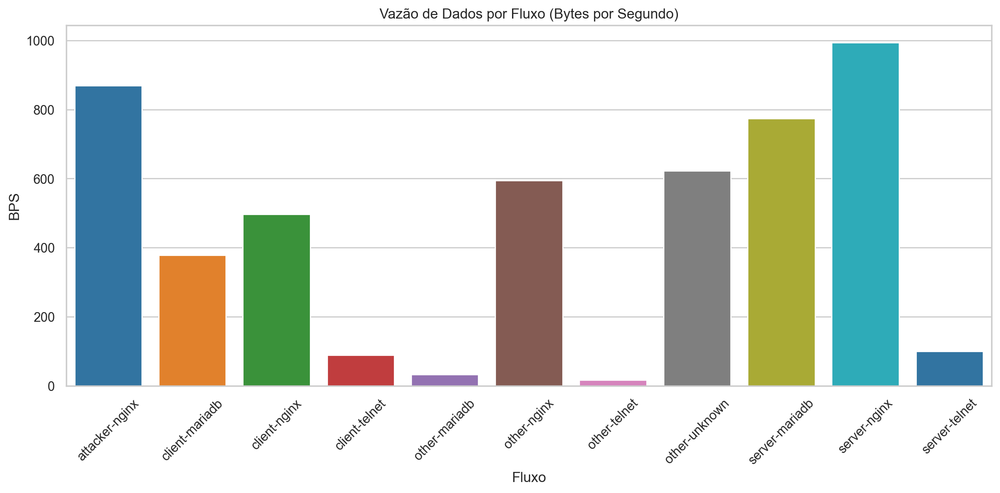
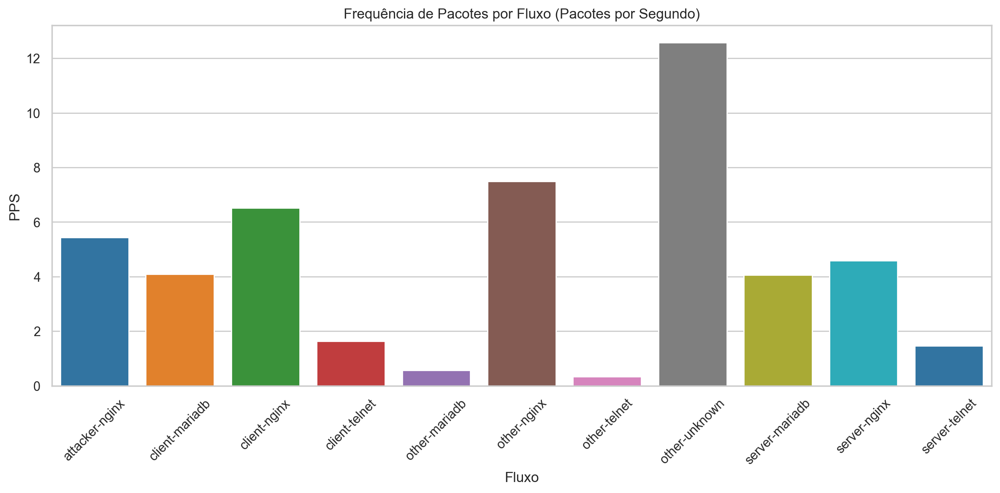
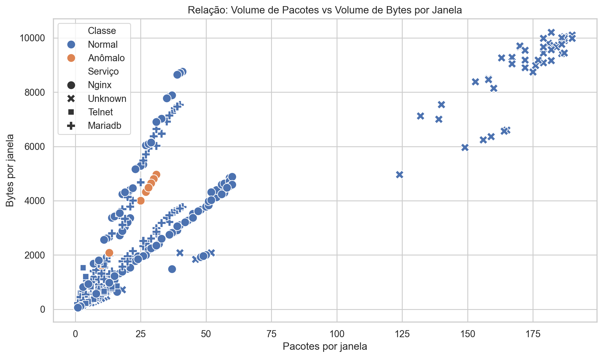
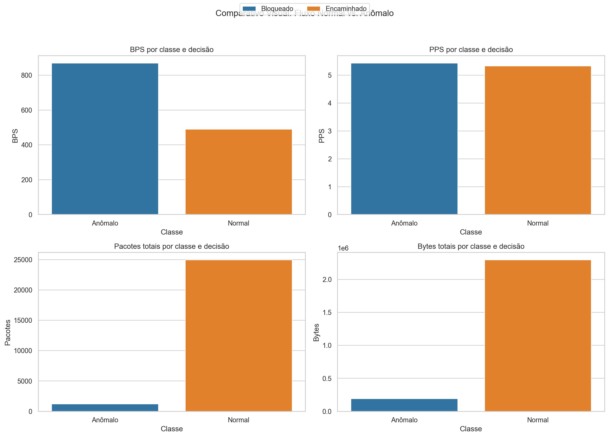

# Relatório de desenvolvimento das atividades

Instituto de Computação - Universidade Estadual de Campinas

Allan M. de Souza, Rafael O. Jarczewski

Nome: José Eduardo Santos

RA: 260551

## Ferramentas e bibliotecas utilizadas

Foram utilizadas as seguintes ferramentas e bibliotecas ao longo do laboratório: Docker e Docker Compose para orquestração do ambiente isolado de rede; Python 3 para implementação do roteador virtual; Scapy para captura, inspeção e reencaminhamento de pacotes; pandas, matplotlib e seaborn para tratamento e visualização dos dados no notebook; e Jupyter Notebook para exploração dos resultados e geração das figuras do relatório.

## Arquivos alterados

Os arquivos alterados para a solução foram roteador/roteador.py, onde foi implementado o mecanismo de captura, inspeção, decisão e registro de métricas; network_analyse.ipynb, responsável pela análise estatística e geração das figuras; e este próprio relatório em markdown, utilizado como base para preenchimento do documento final.

## Análise Estatística do Tráfego (Sniffer)

O sniffer foi construído no próprio roteador virtual, de modo que a captura e a decisão aconteçam no mesmo ponto da topologia. A função principal utilizada foi sniff(), configurada com callback por pacote, o que permite que cada pacote capturado seja imediatamente analisado pela rotina de processamento. O uso de store=0 foi fundamental para evitar acúmulo de pacotes em memória, o que seria problemático em cenários de maior vazão. A função sendp() foi utilizada para reencaminhar os pacotes legítimos após a atualização dos cabeçalhos Ethernet e IP. Também foram importantes get_if_hwaddr() e getmacbyip(), usadas para resolver os endereços MAC das interfaces do roteador e do próximo salto. Diferentemente de uma abordagem baseada em wrpcap(), a estratégia adotada privilegiou o registro estruturado em CSV, permitindo posterior análise quantitativa do tráfego observado.

Durante a execução, o roteador captura pacotes nas duas interfaces, verifica se o pacote possui as camadas IP e Ethernet, evita loops descartando quadros originados pelo próprio roteador, resolve a interface de saída, identifica o endereço MAC de destino e então decide entre encaminhar ou descartar o pacote. Antes do envio, o roteador também decrementa o TTL e força o recálculo dos checksums. Além da função de encaminhamento, foi incorporada uma etapa explícita de inspeção de payload, capaz de classificar o conteúdo em textual, binário ou vazio e registrar marcadores observáveis como comandos de Telnet e requisições HTTP.

O foco desta etapa foi caracterizar o tráfego em condições normais de uso. Para isso, o cliente legítimo gerou requisições HTTP, sessões Telnet e consultas MariaDB, e o roteador registrou o comportamento agregado em janelas de cinco segundos. Esse procedimento permitiu comparar diferentes padrões de serviço e, ao mesmo tempo, estabelecer uma linha de base para diferenciar o comportamento legítimo do comportamento malicioso.

## Filtros e Captura

Filtros BPF utilizados: o filtro principal adotado no roteador foi ip. Esse filtro foi aplicado diretamente no sniff() para restringir a captura ao tráfego IP, que é o relevante para o laboratório. Como apoio conceitual e para inspeção exploratória, o próprio README também sugere filtros mais específicos, como tcp port 23 para Telnet e expressões voltadas a conteúdo textual, mas a implementação final do roteador utilizou ip como filtro geral e realizou a separação posterior por protocolo e serviço na própria lógica da aplicação.

Justificativa: o uso do filtro ip reduz o ruído de tráfego não relevante em camada inferior e preserva a visibilidade dos pacotes que realmente participam da comunicação entre cliente, servidor e atacante. A opção por um filtro amplo, combinada com classificação posterior por portas conhecidas e por conteúdo do payload, foi importante para manter a coleta comparável entre HTTP, Telnet, MariaDB e tráfego anômalo. Essa escolha também evita que a detecção dependa de um único serviço ou de uma porta fixa, o que é coerente com a proposta do laboratório.

## Vazão por Serviço (BPS)

Gráfico:

Análise Descritiva

A Figura 1 mostra a vazão média em bytes por segundo dos fluxos observados, calculada com ponderação pela duração total das janelas. No conjunto analisado, o maior valor foi observado no fluxo server-nginx, com aproximadamente 994,11 B/s. Em seguida aparecem server-mariadb, com aproximadamente 773,48 B/s, e attacker-nginx, com aproximadamente 869,09 B/s. Os fluxos Telnet permaneceram bem abaixo desses valores, com cerca de 88,84 B/s no sentido cliente-servidor e 99,79 B/s no sentido servidor-cliente, o que condiz com um protocolo interativo baseado em comandos curtos. Esses resultados mostram que cada serviço possui uma assinatura própria de volume e que o tráfego malicioso pode se destacar pelo padrão agregado, ainda que não seja necessariamente o fluxo de maior vazão absoluta.

## Frequência de Pacotes

Gráfico:

Análise Descritiva

A Figura 2 apresenta a frequência média em pacotes por segundo. O maior valor observado foi no fluxo client-nginx, com aproximadamente 6,51 pacotes por segundo. O fluxo attacker-nginx apareceu com cerca de 5,43 pacotes por segundo, enquanto server-nginx permaneceu em aproximadamente 4,58 pacotes por segundo. Os fluxos MariaDB ficaram próximos de 4,06 a 4,08 pacotes por segundo, e os fluxos Telnet ficaram abaixo de 1,7 pacote por segundo. Essa distribuição reforça que o critério de decisão não poderia se basear apenas em PPS, pois o ataque pode compartilhar faixa semelhante de frequência com tráfego legítimo. Por isso, a inspeção do payload foi necessária para diferenciar um burst malicioso de uma comunicação normal.

## Volume de pacotes pelo volume de bytes

Gráfico de dispersão (Scatter plot):

Análise descritiva

A Figura 3 relaciona volume de bytes e volume de pacotes por janela. O gráfico evidencia agrupamentos distintos por serviço. Os fluxos Telnet tendem a ocupar regiões de menor volume, refletindo a natureza interativa do protocolo. Já Nginx e MariaDB aparecem em faixas intermediárias e superiores, em razão do maior volume de resposta e do maior número de transações por janela. Os pontos associados ao tráfego malicioso aparecem próximos do comportamento de tráfego web em alguns momentos, o que mostra que uma regra baseada apenas em thresholds simples de bytes ou pacotes geraria risco de falso positivo. A dispersão confirma que a assinatura de conteúdo no payload foi decisiva para separar os pacotes maliciosos dos pacotes normais.

## Detecção de Anomalias e Processamento de Firewall

Nesta etapa, o sniffer passou a atuar como um elemento de rede ativo, ou seja, como um roteador/firewall capaz de decidir o destino do pacote com base no conteúdo e no comportamento observado. A implementação foi feita no próprio fluxo de encaminhamento: o pacote é capturado, analisado e classificado antes da execução do sendp(). Caso a assinatura maliciosa seja confirmada, o pacote é descartado e um alerta agregado é emitido no terminal do roteador.

## 2.1 Comparativo Visual: Fluxo Normal vs. Anômalo

Gráfico:

Análise Descritiva

A Figura 4 compara o comportamento agregado do tráfego normal e do tráfego anômalo. No conjunto atual, todas as janelas classificadas como anomalous aparecem associadas à decisão blocked, enquanto o tráfego normal permanece como forwarded. As janelas anômalas bloqueadas totalizaram 191200 bytes e 1195 pacotes, com média agregada aproximada de 869,09 B/s e 5,43 pacotes por segundo. Já o tráfego normal encaminhado totalizou 2294799 bytes e 24943 pacotes, com média agregada aproximada de 490,19 B/s e 5,33 pacotes por segundo. O painel mostra que o mecanismo de defesa atuou de forma seletiva, bloqueando o burst reconhecido como malicioso sem impedir o funcionamento do tráfego normal do cliente.

## 2.2 Método de Detecção Implementado

O método implementado foi baseado em assinatura de payload. A lógica foi organizada em duas etapas. Primeiro, o roteador observa o conteúdo bruto da camada Raw, quando presente, e classifica o payload em textual, binário ou vazio. Nessa etapa ele também registra marcadores observáveis de conteúdo, como http_get, telnet_username_aluno, telnet_password_lab123 e telnet_command_ls, além de marcadores de baixa entropia para payloads artificiais. Em seguida, o roteador aplica a lista de assinaturas maliciosas. Somente nessa segunda etapa há possibilidade de bloqueio.

Critério de Decisão: não foi utilizado bloqueio por IP de origem, IP de destino, porta de origem ou porta de destino como critério principal. A decisão foi tomada com base no conteúdo do payload e na repetição do padrão observado em uma janela curta de tempo. A assinatura adotada para o cenário atual foi hping3_repeated_x_burst. Essa assinatura exige pacote TCP com camada Raw, payload de 120 bytes, repetição do byte X em todo o conteúdo, baixa diversidade de bytes e repetição do mesmo fingerprint em burst dentro de uma janela curta. Dessa forma, um pacote isolado com esse formato não é suficiente para disparar o bloqueio.

Fluxo de Execução:

O pacote é capturado pela camada de processamento.

O método extrai o payload bruto, quando presente, e registra a observação do conteúdo.

O método verifica os atributos do payload em relação à lista de assinaturas e ao estado de repetição em burst.

Encaminhamento: se o pacote for normal, a função atualiza cabeçalhos, decrementa TTL, recalcula checksums e executa sendp().

Drop: se o pacote for classificado como malicioso, a função registra métricas, emite um alerta agregado e retorna sem executar o sendp().

Durante os testes, o roteador observou 1021 pacotes textuais, 7652 pacotes binários e 17465 pacotes sem payload. Entre os marcadores mais frequentes apareceram http_get com 97 ocorrências, binary_repeated_x com 88 ocorrências, low_entropy_payload com 88 ocorrências, telnet_username_aluno com 71 ocorrências, telnet_command_ls com 64 ocorrências e telnet_password_lab123 com 63 ocorrências. Também foram registrados exemplos textuais reais como aluno, lab123, ls -la e requisições HTTP GET, o que demonstra que a inspeção do conteúdo está de fato ocorrendo.

## 2.3 Eficácia do Firewall

Resultado: sim, o método foi capaz de mitigar a anomalia correspondente à assinatura implementada. No conjunto analisado, foram registradas 44 janelas com decision igual a blocked e 937 janelas com decision igual a forwarded. Todas as janelas bloqueadas foram associadas à assinatura hping3_repeated_x_burst, o que indica que a política atuou de maneira consistente e específica. O tráfego legítimo de Telnet, HTTP e MariaDB permaneceu ativo durante os testes, sem evidência de bloqueio indevido nas janelas encaminhadas observadas.

Conclusão: o processamento no roteador virtual introduz custo adicional de inspeção, pois cada pacote precisa ser avaliado antes do reencaminhamento. Ainda assim, no contexto do laboratório esse custo foi aceitável, já que o loop de captura foi mantido simples, com callback direto e sem armazenamento indiscriminado em memória. Em compensação, o ganho em segurança foi claro: o host final deixou de receber o burst malicioso identificado pela assinatura, enquanto o tráfego legítimo continuou fluindo normalmente. Assim, a solução final atendeu ao objetivo da disciplina ao combinar captura, inspeção de payload, descarte seletivo e coleta de métricas em um único ponto de controle na rede.
